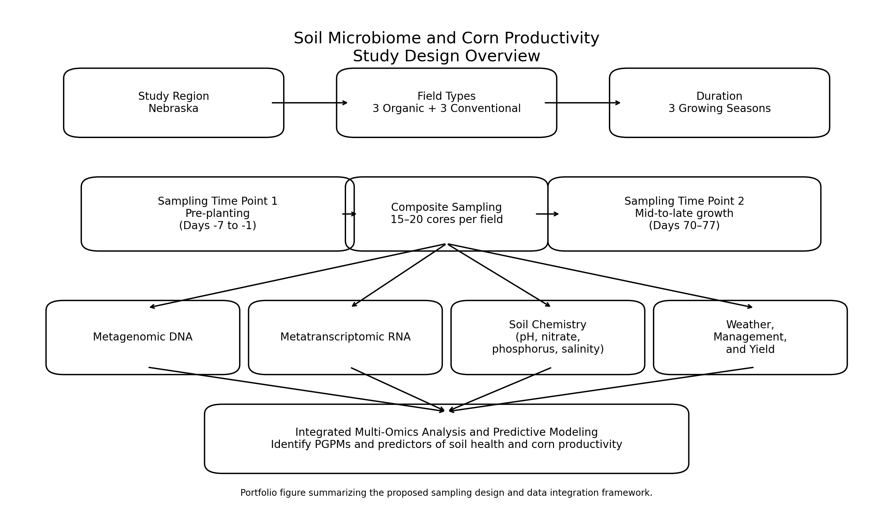
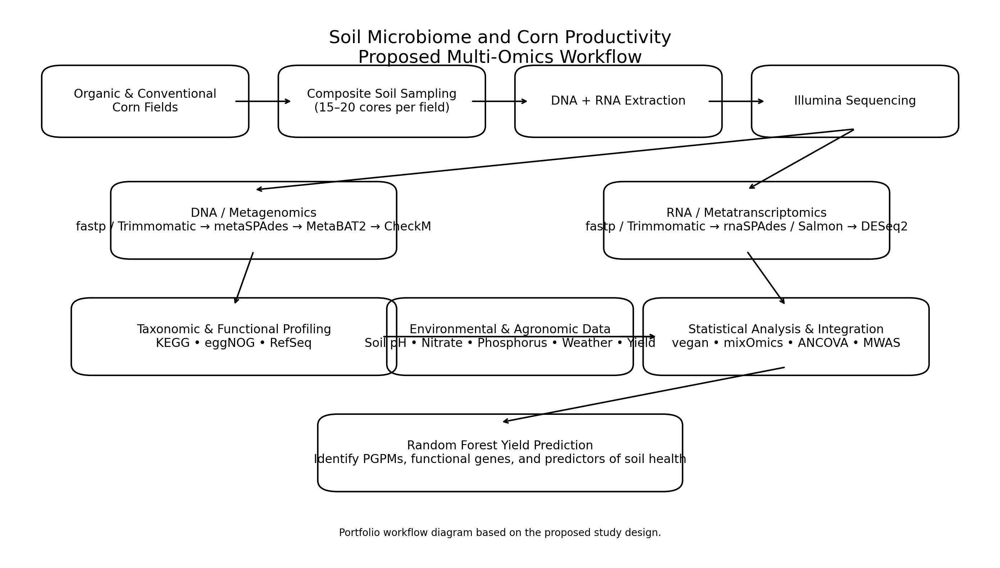

# Soil Microbiome and Corn Productivity

## Overview

This project presents a bioinformatics and multi-omics study design for investigating how plant growth-promoting microbes (PGPMs), microbial functional genes, soil chemistry, and agricultural management practices may relate to corn productivity.

The proposed study compares organic and conventional corn fields and integrates metagenomics, metatranscriptomics, environmental metadata, and predictive modeling.

## Research Objectives

1. Identify microbial taxa and functional genes associated with corn yield.
2. Compare microbial community composition and activity between organic and conventional farming systems.
3. Integrate metagenomic, metatranscriptomic, soil chemistry, and environmental variables.
4. Develop a predictive model of soil health and crop yield.

## Study Design

- Geographic region: Nebraska
- Farming systems: organic and conventional
- Fields: 3 organic and 3 conventional
- Sampling stages:
  - Pre-planting
  - Mid-to-late growth
- Repeated over 3 growing seasons
- Soil composite sampling from 15–20 cores per field and time point

## Study Design Overview

This figure summarizes the proposed sampling framework, including the Nebraska study region, organic and conventional field comparison, seasonal sampling schedule, and integration of multi-omics and environmental data.

## Multi-Omics Workflow

## Workflow Diagram

This workflow diagram outlines the proposed analysis pipeline from field sampling and DNA/RNA extraction through sequencing, read processing, taxonomic and functional profiling, multi-omics integration, and Random Forest yield prediction.

### Metagenomics
- DNA extraction
- Illumina shotgun sequencing
- Read quality control
- Assembly
- Genome binning
- MAG quality assessment
- Taxonomic and functional profiling

### Metatranscriptomics
- RNA extraction
- RNA sequencing
- Transcript assembly
- Quantification
- Differential expression analysis

## Bioinformatics Tools

- fastp
- Trimmomatic
- metaSPAdes
- MetaBAT2
- CheckM
- rnaSPAdes
- Salmon
- KEGG
- eggNOG
- NCBI RefSeq
- DESeq2
- vegan
- mixOmics

## Statistical and Predictive Analysis

Planned analyses include:

- Microbial diversity analysis
- Differential expression
- Microbiome-wide association analysis
- ANCOVA
- Multi-omics integration
- Random Forest modeling
- Yield prediction using microbial and environmental features

## Environmental and Agronomic Data

The study design incorporates:

- Soil pH
- Nitrate-nitrogen
- Phosphorus
- Soil salinity
- Weather
- Fertilization
- Pest management
- Historical land use
- Corn yield

## Project Scope

This repository represents a **study design and bioinformatics workflow proposal**. It does not contain original experimental or sequencing results.

## Skills Demonstrated

Bioinformatics • Metagenomics • Metatranscriptomics • Multi-omics Integration • Experimental Design • Statistical Analysis • Machine Learning • Microbial Ecology • Agricultural Data Science

## Authors

Group project developed by Cory Spern, Dannica Wallace, Xuanyue Zhang, and Kaitlyn Schisler.

## Repository Contents

- `docs/` — study-design summaries and supporting documentation
- `workflow/` — description of the proposed bioinformatics pipeline
- `figures/` — workflow and study-design visuals
- `references/` — selected references supporting the project design and methods
